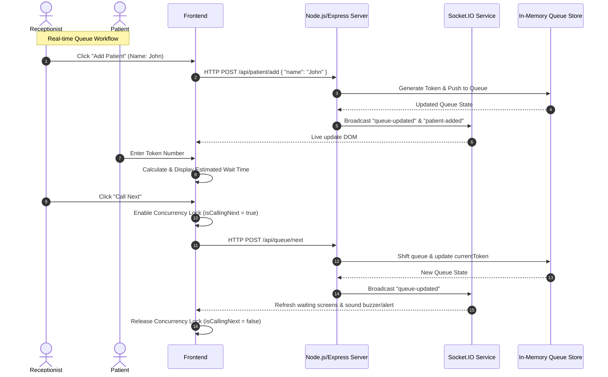

# 🏥 QueueCure - Real-Time Clinic Queue Management System

[](https://github.com/)
[](https://socket.io/)
[](LICENSE)

QueueCure is a lightweight, real-time queue management system built to streamline patient boarding, minimize waiting room congestion, and optimize clinic workflows. Designed specifically for the **Queue Cure '26 Hackathon**, this application features a seamless, synchronized dual-screen experience for both clinic receptionists and waiting patients, operating entirely without page refreshes.

---

## 📋 Table of Contents
1. [Project Overview](#-project-overview)
2. [Key Features](#-key-features)
3. [Technology Stack](#-technology-stack)
4. [System Architecture](#-system-architecture)
5. [Installation & Setup](#-installation--setup)
6. [Usage Guide](#-usage-guide)
7. [API Documentation](#-api-documentation)
8. [Socket.IO Events](#-socketio-events)
9. [Edge Cases & Concurrency Handling](#-edge-cases--concurrency-handling)
10. [Future Roadmap](#-future-roadmap)
11. [Authors & Contributors](#-authors--contributors)

---

## 🌟 Project Overview

Long wait times, crowded clinics, and lack of real-time transparency are common pain points in clinic management. **QueueCure** bridges this gap by providing:
- **Receptionists** with a robust, single-action dashboard to add patients, adjust average consultation times, and call the next patient sequentially.
- **Patients** with an interactive waiting room screen containing live queue tables, auto-updated status trackers, and precise estimated wait time calculations.
- **Real-Time Synchronization** using WebSockets, ensuring both screens stay perfectly in sync instantly, preventing double-calling or queue lag.

---

## ✨ Key Features

### 👩‍💼 Receptionist Dashboard
*   **Add Patients:** Quickly register patient names to the queue with automatic token generation.
*   **Call Next Patient:** One-click sequential processing of the queue.
*   **Average Consultation Time Setting:** Dynamically modify estimated consultation duration to update wait times for all waiting patients.
*   **Concurrency Safeguard:** Visual state indicators and backend concurrency locking (`isCallingNext`) to prevent double-clicks or race conditions.

### 👥 Patient Waiting Room
*   **Real-Time Status Screen:** Large-display waiting queue showing current active token and upcoming patients.
*   **Token Status Checker:** Allows patients to input their token number to view their precise queue position and customized wait time.
*   **Dynamic Estimated Wait Time (EWT) Calculation:** Real-time formula-based countdowns calculated as:
    $$\text{EWT} = \text{Queue Position} \times \text{Avg. Consultation Time}$$
*   **Zero Refreshes:** Socket.IO pushes updates live as they happen.

---

## 🛠️ Technology Stack

| Layer | Technology | Usage |
| :--- | :--- | :--- |
| **Frontend** | HTML5 | Semantically structured UI components |
| | CSS3 | Custom typography, clean card-based responsive layout, transitions |
| | JavaScript (ES6) | Client-side logic and real-time DOM manipulation |
| **Backend** | Node.js | Runtime environment |
| | Express.js | REST API routing and static asset serving |
| | Socket.IO | Bi-directional WebSocket communication |

---

## 🔄 System Architecture



---

## ⚙️ Installation & Setup

### Prerequisites
*   [Node.js](https://nodejs.org/) (v14.x or higher)
*   [npm](https://www.npmjs.com/) (v6.x or higher)

### Setup Steps
1.  **Clone the repository:**
    ```bash
    git clone https://github.com/your-username/QueueCure.git
    cd QueueCure
    ```
2.  **Install dependencies:**
    ```bash
    npm install
    ```
3.  **Run the application:**
    *   **Development Mode** (with hot-reloading via `nodemon`):
        ```bash
        npm run dev
        ```
    *   **Production Mode**:
        ```bash
        npm start
        ```
4.  **Access the application:**
    *   Receptionist Dashboard: [http://localhost:3000/receptionist.html](http://localhost:3000/receptionist.html)
    *   Patient Waiting Room: [http://localhost:3000/index.html](http://localhost:3000/index.html)

---

## 📖 Usage Guide

### Scenario A: Receptionist Flow
1. Open the Receptionist Dashboard.
2. Under "Add Patient", type the patient's name and click **Add**. A token (e.g., `1001`) is generated instantly.
3. If necessary, adjust the **Average Consultation Time** (e.g., set to `10` minutes). This will instantly update the estimated wait times on the patient display.
4. When the doctor is ready, click **Call Next**. The current token will update, and the patient is notified.

### Scenario B: Patient Flow
1. View the large dashboard on the waiting room screen.
2. Check the **Currently Serving** panel to see if your token is called.
3. Use the **Token Status Checker** input box: enter your token number to see exactly how many patients are ahead of you and your estimated waiting time in minutes.

---

## 🌐 API Documentation

All API endpoints are prefixed with `/api`.

### 1. Add Patient
*   **URL:** `/api/patient/add`
*   **Method:** `POST`
*   **Content-Type:** `application/json`
*   **Request Body:**
    ```json
    {
      "name": "Jane Doe"
    }
    ```
*   **Success Response (201 Created):**
    ```json
    {
      "success": true,
      "patient": {
        "token": 1003,
        "name": "Jane Doe",
        "position": 3,
        "estimatedWait": 30
      }
    }
    ```

### 2. Get Queue State
*   **URL:** `/api/queue`
*   **Method:** `GET`
*   **Success Response (200 OK):**
    ```json
    {
      "currentToken": 1001,
      "waitingList": [
        {
          "token": 1002,
          "name": "John Doe",
          "position": 1,
          "estimatedWait": 10
        },
        {
          "token": 1003,
          "name": "Jane Doe",
          "position": 2,
          "estimatedWait": 20
        }
      ],
      "avgConsultationTime": 10,
      "totalWaiting": 2
    }
    ```

### 3. Call Next Patient
*   **URL:** `/api/queue/next`
*   **Method:** `POST`
*   **Success Response (200 OK):**
    ```json
    {
      "success": true,
      "currentToken": 1002,
      "waitingList": [
        {
          "token": 1003,
          "name": "Jane Doe",
          "position": 1,
          "estimatedWait": 10
        }
      ]
    }
    ```

### 4. Set Average Consultation Time
*   **URL:** `/api/queue/set-time`
*   **Method:** `POST`
*   **Content-Type:** `application/json`
*   **Request Body:**
    ```json
    {
      "avgTime": 15
    }
    ```
*   **Success Response (200 OK):**
    ```json
    {
      "success": true,
      "avgConsultationTime": 15,
      "waitingList": [
        {
          "token": 1003,
          "name": "Jane Doe",
          "position": 1,
          "estimatedWait": 15
        }
      ]
    }
    ```

---

## ⚡ Socket.IO Events

The real-time synchronization is driven by these events:

### Server-Emitted Events

#### `queue-updated`
Sent to all connected clients whenever the queue state undergoes any modification (e.g., patient added, next called, avg time adjusted).
*   **Payload:**
    ```json
    {
      "currentToken": 1002,
      "waitingList": [
        {
          "token": 1003,
          "name": "Jane Doe",
          "position": 1,
          "estimatedWait": 15
        }
      ],
      "avgConsultationTime": 15,
      "totalWaiting": 1
    }
    ```

#### `patient-added`
Sent to all clients when a new patient joins the queue. Can be used on the client-side to show toast notifications or sound alerts.
*   **Payload:**
    ```json
    {
      "token": 1004,
      "name": "Alice Smith",
      "position": 2,
      "estimatedWait": 30
    }
    ```

---

## 🛡️ Edge Cases & Concurrency Handling

*   **Double-Click Concurrency Lock (`isCallingNext`):** 
    To prevent a receptionist from double-clicking the "Call Next" button (which could trigger rapid consecutive requests, shifting patients incorrectly), the client dashboard activates an `isCallingNext` flag. The button is disabled and incoming clicks are blocked until the server responds and broadcasts the state change.
*   **Empty Queue Processing:**
    If `POST /api/queue/next` is hit while the waiting queue is empty, the server returns a structured `400 Bad Request` payload:
    ```json
    {
      "error": "No patients currently in the waiting list."
    }
    ```
    This error is gracefully displayed on the Receptionist Dashboard, preventing app crashes.
*   **Data Validation:**
    *   Empty names or inputs consisting only of whitespace are blocked on both client and server layers.
    *   Average consultation times are clamped to a minimum of `1` minute to avoid dividing or multiplying by zero or generating negative wait times.

---

## 🚀 Future Roadmap

1.  **🔔 Patient Notifications:** Send text messages (SMS) or WhatsApp notifications automatically to patients when their turn is approaching (e.g., 3 patients ahead).
2.  **🔒 Role-Based Access Control:** Secure the `/receptionist` route with authentication (JWT/OAuth) to prevent unauthorized patients from managing the queue.
3.  **📂 Database Integration:** Transition from in-memory arrays to MongoDB/PostgreSQL to persist queue history and analyze daily clinic metrics.
4.  **🔊 Text-to-Speech Integration:** Automatically announce called tokens in the waiting room using synthesized voice alerts (e.g., *"Now calling token number 1002"*).

---

## 👥 Authors & Contributors

*   **Your Name / Team Name** - *Full Stack Developer* - [GitHub Profile](https://github.com/your-username)
*   Built with ❤️ for **Queue Cure '26**
